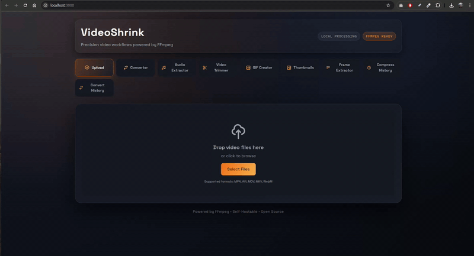

# VideoShrink

Self-hosted video compression and transcoding with a modern web UI. VideoShrink queues jobs via Redis, processes them with FFmpeg, and stores results locally or in S3-compatible storage.



## Features

- Drag-and-drop uploads for video and audio files.
- Format conversion with presets and validation.
- Audio extraction from video files.
- Video trimming with start/end times.
- GIF creation with size and quality options.
- Frame extraction to JPG/PNG sequences with time range, FPS, and ZIP download.
- Thumbnail generation for uploads and jobs.
- Realtime progress tracking and job history.
- Download endpoints for processed outputs.
- Local storage or MinIO/S3-compatible storage.
- Docker Compose-based deployment.

## Architecture

- `frontend/`: React + Vite + Tailwind UI served by Nginx.
- `backend/`: Fastify API + Prisma + BullMQ.
- `worker/`: Job processor running FFmpeg.
- `docker-compose.yml`: Postgres, Redis, MinIO, backend, worker, frontend.

## Quick start (Docker Compose)

Prereqs: Docker + Docker Compose.

```bash
docker compose up --build
```

Services and ports:

- Frontend: `http://localhost:3000`
- Backend API: `http://localhost:4001`
- Postgres: `localhost:5433`
- Redis: `localhost:6380`
- MinIO API: `http://localhost:9002`
- MinIO Console: `http://localhost:9003`

The backend container runs Prisma migrations on startup.

### Configuration

The defaults live in `docker-compose.yml`. Override with a `.env` file if needed:

```bash
POSTGRES_USER=videoshrink
POSTGRES_PASSWORD=videoshrink
POSTGRES_DB=videoshrink
MINIO_ROOT_USER=minioadmin
MINIO_ROOT_PASSWORD=minioadmin
NODE_ENV=development
```

## Local development (without Docker)

Prereqs: Node.js 20+, FFmpeg, Postgres, Redis, and optionally MinIO.

Run each service in its own terminal:

```bash
# backend
cd backend
npm install
npm run dev
```

```bash
# worker
cd worker
npm install
npm run dev
```

```bash
# frontend
cd frontend
npm install
npm run dev
```

Set environment variables to match your local services. For Docker-based dependencies, you can still use:

```bash
docker compose up postgres redis minio
```

## Scripts

- `backend/`: `npm run dev`, `npm run build`
- `worker/`: `npm run dev`, `npm test`
- `frontend/`: `npm run dev`, `npm run build`, `npm run lint`

## Repo layout

```text
backend/   Fastify API + Prisma + BullMQ
worker/    FFmpeg job processor
frontend/  React UI
```
# videoshrink
